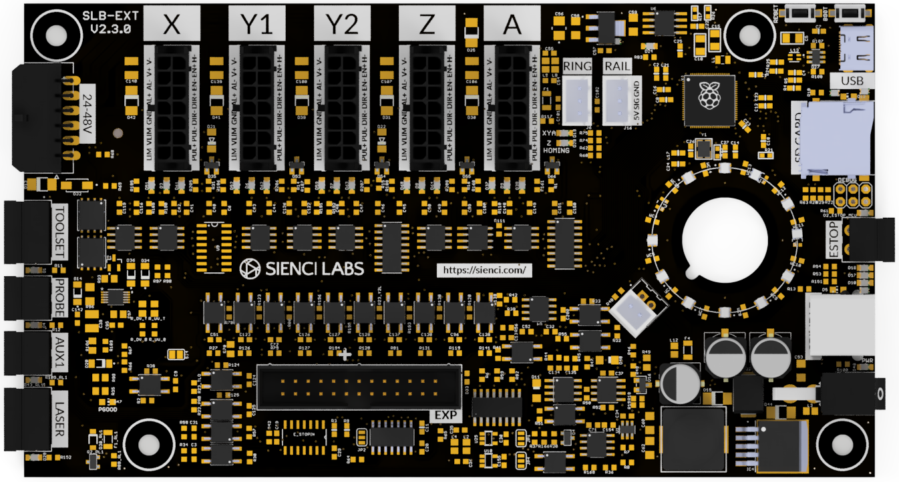
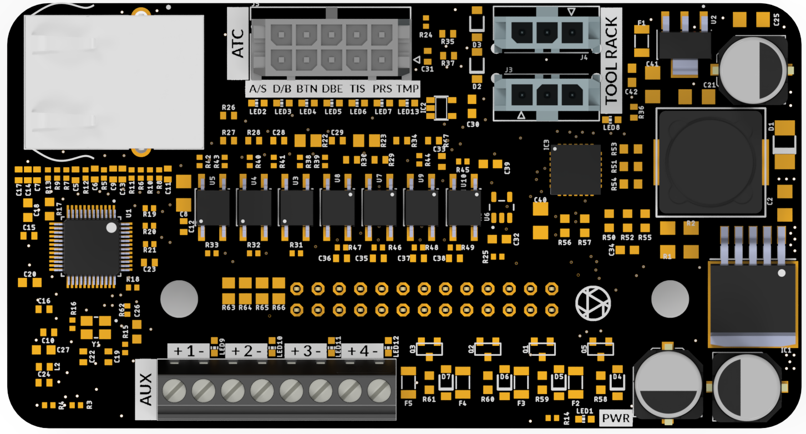

# SuperLongBoard EXT V2

The **SuperLongBoard EXT V2 (SLB-EXT V2)** is Sienci Labs’ next-generation CNC controller developed for the AltMill platform.

## Key Features

* grblHAL-based firmware
* Four-axis motion control
* Closed-loop stepper motor support
* USB connectivity
* SD card support
* Spindle, router and laser support
* Tool-length sensor support
* Auto-squaring
* Advanced breakout-board expansion
